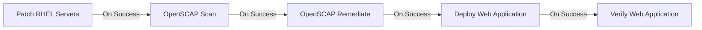

# Automation Controller Workflow Setup

This workflow chains the demo job templates into a single end-to-end automation pipeline, similar to the [Ansible RHEL Workshop workflows exercise](https://labs.demoredhat.com/exercises/ansible_rhel/2.6-workflows/).

## Workflow: RHEL Operations Pipeline

**Name:** `DEMO - RHEL Operations Pipeline`

### Visual Flow




### Configured on sandbox

| Resource | Value |
|----------|-------|
| Workflow job template | **DEMO - RHEL Operations Pipeline** (id: 49 on jmvv9) |
| Inventory | Workshop Inventory (id: 34) |
| Node chain | Job templates 44 → 45 → 46 → 47 → 48 (On Success) |
| Self-service | Exposed to `demo-user` via `configure-self-service.sh` |

### Self-service launch

The workflow is available in the self-service catalog alongside individual job templates. Presenters can launch the full pipeline from:

- **Controller:** sign in as `demo-user` → **Automation Execution → Templates**
- **Automation Portal:** same credentials when the portal component is deployed

See `controller/self-service-setup.md` for RBAC setup and verification.

### Create the Workflow

1. Go to **Automation Execution → Templates → Create template → Create workflow job template**
2. Set **Name** to `DEMO - RHEL Operations Pipeline`
3. Set **Organization** to `Default`
4. Set **Inventory** to `Workshop Inventory`
5. Click **Create workflow job template** to open the Workflow Visualizer

### Add Workflow Nodes

| Step | Node Type | Template | Run Condition |
|------|-----------|----------|---------------|
| 1 | Job Template | DEMO - Patch RHEL Servers | Always (start node) |
| 2 | Job Template | DEMO - OpenSCAP Scan | On Success |
| 3 | Job Template | DEMO - OpenSCAP Remediate | On Success |
| 4 | Job Template | DEMO - Deploy Web Application | On Success |
| 5 | Job Template | DEMO - Verify Web Application | On Success |

### Workflow Tips for Demos

- **Show the visualizer** before launching — explain how operations teams chain patching, compliance, and deployment.
- **Launch from the workflow** rather than individual templates to demonstrate orchestration.
- **Drill into failed nodes** — if OpenSCAP remediation times out, show how the workflow stops and surfaces the failure.
- **Use surveys on the Deploy node** — add survey questions to the Deploy Web Application template so presenters can customize content at launch time.

### Optional: Parallel Scanning

For larger environments, you could run OpenSCAP Scan as a parallel node across host subsets. In this 3-node sandbox, sequential execution keeps the demo readable.

### Workflow Launch Variables

Pass these at workflow launch if you want security-only patching:

```yaml
security_only: true
reboot_after_patch: false
dev_content: "Live demo - development"
prod_content: "Live demo - production"
```

### Monitoring the Workflow

After launch:

1. Open the workflow job detail page
2. Watch each node transition (pending → running → success/failed)
3. Click any completed node to view its stdout, timing, and host-level results
4. Navigate to **Views → Automation Dashboard** to see aggregate metrics (see `monitoring/automation-dashboard.md`)
